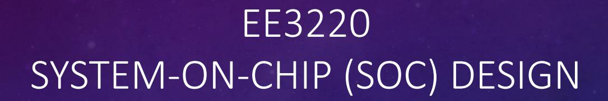

TEAM-BASED LEARNING (TBL) RISC-V MISSION CLOCK IMPLEMENTATION

23 MARCH 2026

# PURPOSE OF THIS TBL

- Apply SoC design concepts
- Integrate RISC-V core, UART, timer, firmware
- Practice MMIO and system integration
- Build a working system under time pressure

# SCHEDULE AND FLOW

• iRAT: 3:00 – 3:15pm

• Team Based Project: 3:15 – 5:30pm

• Target Completion: 5:30pm

• Presentation: 5:30 – 5:45pm

• Award Ceremony: 5:45 – 5:50pm

# SYSTEM ARCHITECTURE

- Given:
  - RISC-V CPU, Memory
- Implement:
  - MMIO UART
  - MMIO Timer
  - Firmware

# WHAT SUCCESS LOOKS LIKE

- Start at 00:00:00
- Update every second
- Correct rollover
- Optional: VT100/ANSI
- Optional: Clock setting via UART / Pushbuttons

# GRADING AND EXPECTATION

- Functional correctness mandatory
- Creative designs receives bonuses
- FPGA demo
- System integration
- TAs will NOT debug your design