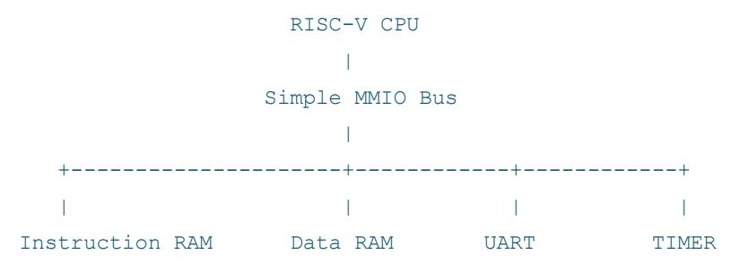

# EE3220 Team-Based Learning Project

## Open-Source Space Shuttle Mission Clock Challenge

# 1. Project Overview

Your company, Space-Z, is developing an open-source interplanetary space shuttle, where both hardware and software designs are openly inspectable by engineers around the world. Before launching complex subsystems such as navigation computers and flight controllers, mission control needs a reliable "mission clock." Your team will build a RISC-V-based mission clock system that displays time through a UART terminal.

#### The clock must:

- boot correctly
- keep time accurately
- display the time clearly to a human operator

To keep the challenge focused and achievable within the class period, a working RISC-V processor subsystem will be provided. Your team will extend the system by implementing the peripherals and firmware required to run the mission clock.

#### You will implement:

- a UART peripheral
- a timer peripheral
- bare-metal firmware for the clock
- a basic SystemVerilog testbench

A working RISC-V processor subsystem and memory system will be provided to all teams. Your task is to extend the provided system with the required peripherals.

# 2. Project Background

# 2.1 Why a mission clock?

A mission clock appears simple — until it fails.

#### If the time is wrong:

- logs become misleading
- scheduled events drift
- operators lose trust in the system

Mission control displays do not need to be fancy, but they must be trustworthy.

This challenge connects multiple system-design ideas:

- processor architecture
- SoC integration
- memory-mapped peripherals
- firmware
- simulation
- human-visible I/O

A correct mission clock is small enough to implement in a course, yet rich enough to expose real design mistakes.

# 2.2 What is RISC-V?

RISC-V is an open instruction set architecture (ISA) developed at the University of California, Berkeley beginning around 2010. An ISA defines the instructions a processor understands, but it is not limited to a specific chip or CPU core. The name RISC-V means "RISC version 5." It follows a series of earlier RISC processor research projects developed at Berkeley.

- 1981: RISC-I first Berkeley experimental RISC processor
- 1983: RISC-II improved Berkeley RISC design
- mid-1980s onward Berkeley RISC ideas influenced commercial RISC architectures such as SPARC and the wider RISC movement
- 2010s: RISC-V modern open ISA from Berkeley

The earlier Berkeley RISC processors were research prototypes that helped demonstrate an important idea: a processor with a simple instruction set can achieve high performance if its instructions execute very quickly. This idea became known as Reduced Instruction Set Computing (RISC) and influenced many commercial architectures, including ARM, MIPS, SPARC, and PowerPC.

RISC-V continues this research tradition but introduces a major difference: the architecture specification is open and freely available. Anyone can design a processor implementing the RISC-V ISA without paying licensing fees. However, an open ISA does not mean every implementation is open-source. Instead, it means both open and commercial implementations are possible.

One important feature of RISC-V is that it is modular. The ISA is built from a small base instruction set plus optional extensions.

Common base ISAs include:

- RV32I 32-bit base integer ISA
- RV64I 64-bit base integer ISA

Common extensions include:

• M — integer multiply and divide

- A atomic memory operations
- F single-precision floating point
- D double-precision floating point
- C compressed instructions
- V vector instructions

For instance, RV32IMC means a 32-bit base integer ISA with integer multiply/divide and compressed instructions. Examples of well-known RISC-V cores include Ibex, Rocket, BOOM, and PicoRV32. In this project, the processor subsystem provided in the starting system is based on the PicoRV32 core. Your team should extend the system by adding peripherals and firmware.

## 2.3 ARM versus RISC-V

In EE3220 we primarily study the ARM instruction set architecture, which is widely used in commercial products. ARM and RISC-V represent two different design philosophies.

#### ARM

- proprietary ISA
- mature commercial ecosystem
- dominant in mobile and embedded systems
- architecture access controlled through licensing

## RISC-V

- open ISA
- modular base ISA plus extensions
- easy to inspect, extend, and customize
- popular in research and open hardware projects
- growing ecosystem

ARM is widely used in smartphones, tablets, and many embedded systems. RISC-V is especially attractive in situations where designers want greater architectural freedom. One major advantage of RISC-V is the ability to support custom instructions. This is important especially in:

- artificial intelligence
- digital signal processing
- cryptography
- multimedia processing

For example, many AI workloads rely heavily on multiply-accumulate operations, such as:

```
rd[3:0] = rs1[3:0] × rs2[3:0] + rs3[3:0]
```

Because RISC-V is designed to be extensible, it is attractive for domain-specific accelerators and AI-oriented processors. For this challenge, RISC-V is used because the ISA and many implementations can be openly studied, while still connecting directly to modern SoC ideas such as customization and hardware acceleration.

## 2.4 A simple RISC-V system

A small RISC-V system typically contains:

- processor core (e.g. PicoRV32)
- instruction memory
- data memory
- memory-mapped peripherals

A simplified architecture used in this TBL is shown below.



#### Processor Implementation

The processor subsystem used in this project is implemented using the PicoRV32 RISC-V core. PicoRV32 is a small and FPGA-friendly RV32I processor designed for simple integration. It exposes a simple memory interface used for both instruction and data accesses. Peripherals such as the UART and timer are implemented as memorymapped devices that respond to accesses on this interface.

In this challenge, the processor core is already provided. Your team's task is to design the system-on-chip components around the processor, including peripherals, firmware, and verification.

## 2.5 RISC-V development toolkit

A processor is not useful unless software can be built for it.

For this project the RISC-V toolkit includes:

#### Cross compiler

- This tool compiles C programs for the RISC-V processor.
- Example: riscv32-unknown-elf-gcc

## Assembler and linker

• The assembler converts assembly code into machine instructions. The linker places program sections at the correct memory addresses and produces the final executable image.

#### Binary utilities

• Tools, such as objdump and objcopy, allow inspection and conversion of compiled programs. These tools are useful when generating memory images for simulation or FPGA execution.

#### Simulation

• Simulation allows the hardware and firmware to be verified before programming the FPGA. For this project, Vivado xsim will be used for simulation.

#### UART terminal

- Typical tools include PuTTY, Tera Term, Minicom, and screen. These tools allow you to observe the mission clock output.
- Many terminal programs also support VT100/ANSI terminal emulation, meaning they interpret escape sequences sent over UART for clear screen, cursor movement, and text color.

#### Open-source hardware and EDA ecosystem

- One important reason RISC-V has become popular is its strong connection to open-source hardware tools.
- This open ecosystem is valuable in education, research, and industrial prototyping because it allows engineers to study and build more of the hardware/software stack using open tools.
- Examples include:
  - o Verilator RTL simulation
  - o Yosys logic synthesis
  - o OpenROAD physical design
  - o Spike RISC-V ISA simulation
  - o QEMU full-system emulation

While the official lab flow uses Vivado and the PYNQ board, students should also be aware that RISC-V is strongly supported by a wider open-source tool ecosystem.

# 3. Team Organization and Roles

Each team must assign the following roles. One person may hold more than one role, but every role must be clearly owned.

#### Team Leader

- coordinates work distribution
- ensures integration happens on time
- manages submission

### SoC Engineers

- integrate peripherals into the provided RISC-V system
- define and document the memory map and peripheral register map

#### Peripheral Engineers

• implement UART and timer hardware

#### Firmware Engineers

- write the mission clock software
- handle time updates and rollover

#### Verification Engineers

- run simulation
- debug waveform behavior
- verify clock functionality

#### AI Engineers (Prompt & Code Auditor)

- use AI tools to accelerate development
- maintain the AI usage log
- verify correctness of AI-generated code

# 4. Provided Starting System

To ensure the challenge is achievable within the class session, a working RISC-V SoC skeleton will be provided.

The provided system includes:

- RV32I processor core (PicoRV32)
- instruction memory
- data memory
- basic bus interconnect
- top-level FPGA wrapper (pynq\_z2\_tx\_demo\_top.sv)

Students must not modify the processor. Students implement only the following modules:

- uart.sv
- timer.sv
- clock.c

This allows teams to focus on peripheral design and firmware development, which are the key learning objectives of this exercise.

### Peripheral Integration

The UART and timer must be implemented as memory-mapped peripherals. They connect to the processor through the provided memory bus and respond to accesses within their assigned address ranges. Teams implementing the SoC integration role will define the memory map and ensure the correct peripheral responds to each address region.

Each team must define and document a consistent MMIO interface for the UART and timer. At minimum, the design must provide a UART transmit path, a UART-ready or UART-busy status indication, and a timer-visible event or status that firmware can use to update the clock once per second. The exact addresses may be chosen by the team, but the same documented interface must be used consistently by the hardware, firmware, and testbench.

# 5. Project Specification

## 5.1 Official platform

The official hardware platform is the PYNQ-Z2 board used in the EE3220 laboratory.

Required environment:

- PYNQ-Z2 board
- Vivado 2022.2
- UART terminal program

Each team will have access to a dedicated PC with Vivado preinstalled and a PYNQ FPGA board. Teams will synthesize the design, generate the bitstream, and demonstrate the mission clock running on the FPGA hardware.

## 5.2 Build and Bring-up Flow

The project has two build flows: a firmware flow and a hardware flow.

#### Firmware flow

- 1. Compile the bare-metal C program for the provided RISC-V processor.
- 2. Link the program with the provided startup file and linker.ld to produce an executable image such as clock.elf.
- 3. Convert clock.elf into a memory initialization file such as clock.mem.
- 4. Use clock.mem to initialize the instruction memory for simulation and FPGA implementation.
- 5. You can refer to our reference Makefile for more details.

#### Hardware flow

- 1. Simulate the RTL design in Vivado xsim.
- 2. Include the clock.mem memory initialization file in the firmware flow.
- 3. Synthesize and implement the SoC design in Vivado.

- 4. Generate the FPGA bitstream.
- 5. Connect the PYNQ board to the host PC.
- 6. Open Vivado Hardware Manager, connect to the hardware target, and program the FPGA with the generated bitstream.
- 7. Open a UART terminal at 115200 baud, 8 data bits, no parity, 1 stop bit, and observe the mission clock output.

In this TBL, firmware is loaded through the instruction-memory initialization file used by the FPGA design. Therefore, teams do not need a separate runtime firmware download step on the PYNQ board.

### Typical build artifacts

```
• clock.c + start.S + linker.ld → clock.elf → clock.mem
• uart.sv + timer.sv + top-level → design.bit
```

# 5.3 Required system architecture

Your final system must include:

- provided RISC-V processor subsystem
- instruction memory
- data memory
- UART peripheral
- timer peripheral
- mission clock firmware

#### UART Hardware Connection

The UART peripheral must expose the signals:

```
• tx : UART transmit output
```

• rx : UART receive input

These signals must be connected to the FPGA top-level ports:

```
• input wire uart_rxd
```

- output wire uart\_txd
- uart.tx must drive uart\_txd, which connects to the board's USB-UART interface.
- uart.rx must receive from uart\_rxd, which comes from the board's USB-UART interface.

#### Reference MMIO Register Interface

To keep the hardware, firmware, and testbench consistent across all teams, this TBL uses the following reference MMIO interface.

```
• UART_BASE = 0x4000_0000
```

```
• TIMER_BASE = 0x4000_0010
• UART_TXDATA @ UART_BASE + 0x00
      o write [7:0] = character to transmit
• UART_STATUS @ UART_BASE + 0x04
      o read bit[0] = tx_ready
      o 1 = UART can accept a new transmit character
      o 0 = UART is busy
• TIMER_STATUS @ TIMER_BASE + 0x00
      o read bit[0] = tick_pending
      o write bit[0] = 1 clears tick_pending
• TIMER_VALUE @ TIMER_BASE + 0x04
      o optional current counter value or debug register
```

#### Minimum behavioral requirements

- Writing a byte to UART\_TXDATA starts UART transmission when tx\_ready = 1.
- Firmware must poll UART\_STATUS[0] before writing the next transmit byte.
- TIMER\_STATUS[0] becomes 1 once per second.
- Firmware clears the timer event by writing 1 to TIMER\_STATUS[0].

#### Example C definitions

```
#include <stdint.h>
#define REG32(addr) (*(volatile uint32_t *)(addr))
#define UART_BASE 0x40000000u
#define UART_TXDATA REG32(UART_BASE + 0x00u)
#define UART_STATUS REG32(UART_BASE + 0x04u)
#define UART_TX_READY 0x00000001u
#define TIMER_BASE 0x40000010u
#define TIMER_STATUS REG32(TIMER_BASE + 0x00u)
#define TIMER_VALUE REG32(TIMER_BASE + 0x04u)
#define TIMER_TICK 0x00000001u
```

#### Example polling style

```
static void uart_putc(char c) {
 while ((UART_STATUS & UART_TX_READY) == 0u);
 UART_TXDATA = (uint32_t)(uint8_t)c;
}
static int timer_tick_pending(void) {
 return (TIMER_STATUS & TIMER_TICK) != 0u;
}
static void timer_clear_tick(void) {
```

```
 TIMER_STATUS = TIMER_TICK; // write-1-to-clear
}
```

## 5.4 Mission clock behavior

Base requirements:

- after reset the clock starts at 00:00:00
- the display updates once per second
- second, minute, and hour rollover must be correct

The timer may be implemented either as a counter with a one-second status flag or as a periodic tick source visible to firmware. The chosen interface must be documented in README.md and used consistently by the hardware, firmware, and testbench.

#### Required transitions:

```
00:00:59 → 00:01:00
00:59:59 → 01:00:00
23:59:59 → 00:00:00
```

#### Example display:

```
MISSION CLOCK 12:34:56
```

The display may either print a new line each second, or update in place using carriage return. Using carriage return alone is sufficient for the base requirement; VT100/ANSI escape-sequence features are optional bonus features only.

Only UART transmit is required for the base mission clock display. UART receive may be optionally used for clock setting, or you may simply use PYNQ board push buttons for clock setting.

## 5.5 UART configuration

The UART peripheral implemented by each team must use the following configuration.

- 115,200 baud
- 8 data bits
- no parity
- 1 stop bit

## 5.6 Optional advanced features

Teams may optionally implement:

- UART command to set the time
- pause / resume command
- countdown timer mode

- alarm message
- mission elapsed time display

## 5.7 VT100/ANSI terminal bonus

Extra credit is available for terminal-control features such as:

- clear screen on boot
- colored text
- blinking colon
- mission console layout

#### Example:

```
===================================
 Open-Source Space Shuttle Console
===================================
MISSION CLOCK 12:34:56
```

# 6. System Verification and Validation

## 6.1 Simulation Verification

Your testbench should verify:

- reset behavior
- UART output
- second increments
- minute rollover
- hour rollover
- day rollover

For simulation, teams may reduce timer or UART divisors, preload the clock near rollover values, or directly simulate timer tick events. The FPGA demonstration, however, must use the official UART configuration and real on-second behavior.

Example directed tests:

## Case A

• Reset → first output 00:00:00

#### Case B

• Next tick → 00:00:01

#### Case C

```
• 00:00:59 → 00:01:00
```

#### Case D

• 00:59:59 → 01:00:00

#### Case E

• 23:59:59 → 00:00:00

## 6.2 FPGA Validation

In addition to simulation, teams must demonstrate their design on the PYNQ FPGA board.

A successful demonstration requires:

- 1. The design synthesizes and generates a bitstream.
- 2. The FPGA is programmed successfully.
- 3. The UART terminal displays the mission clock.
- 4. The clock increments correctly for at least three seconds.

#### Example terminal output:

```
MISSION CLOCK 12:34:56
MISSION CLOCK 12:34:57
MISSION CLOCK 12:34:58
```

Both simulation and hardware demonstration must succeed for the project to be considered complete.

# 7. Deliverables

### Submit:

```
• team_<XX>_submission.zip
```

#### Contents:

```
• uart.sv
• timer.sv
• tb_basic.sv
• firmware/
      o clock.c
```

```
o linker.ld
o Makefile
```

• clock.mem

- README.md
- report.pdf
- ai\_log.txt

### README.md must include:

- Build steps and simulation commands
- the team's MMIO memory map and register semantics
- a short division of labor

### report.pdf should briefly describe:

- the system architecture
- the UART/timer interface
- the firmware strategy

# 8. The Challenge

The class consists of 129 students divided into 22 teams.

The Open-Source Space Shuttle Mission Clock Challenge has three awards:

#### Gold Launch Award

• One of the first three teams to pass the official checkoff with best implementation.

### Silver Orbit Award

• One of the first three teams to pass the official checkoff with second best implementation.

### Bronze Booster Award

• One of the first three teams to pass the official checkoff.

Each award carries extra credit.

#### Challenge rules:

- ranking is based on checkoff completion time and implementation features
- simulation and hardware demo must both work
- each team has two final checkoff attempts

Mission time waits for nobody.