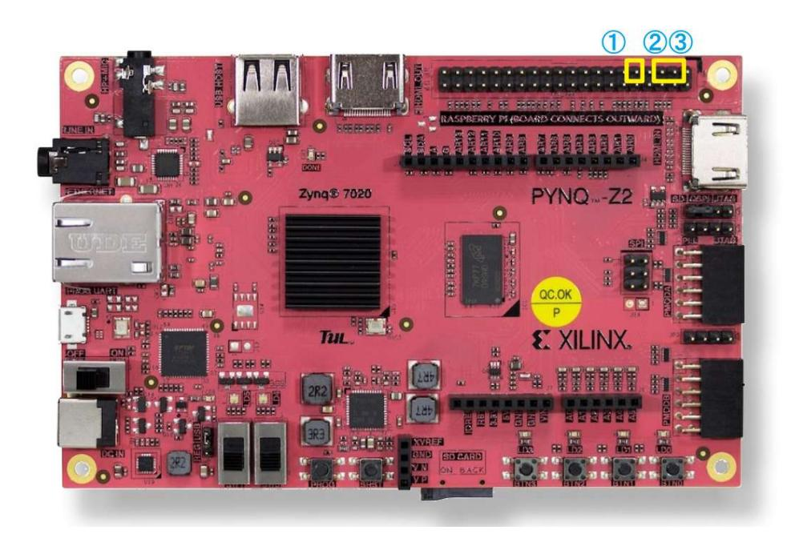
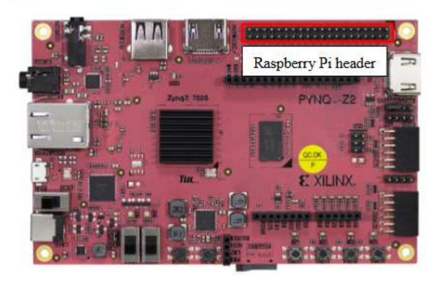
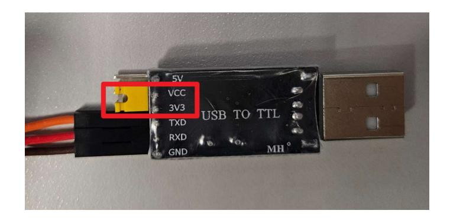
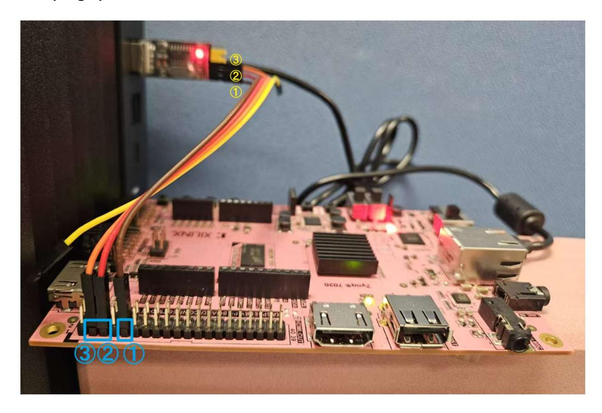

# EE3220 TBL2

# Connections between CH340 and PYNQ-Z2

### 1. Required wiring

| PYNQ-Z2 side | CH340 side | Direction Notes |                                                        |  |  |  |  |  |
|--------------|------------|--------------------|--------------------------------------------------------|--|--|--|--|--|
| ① GND        | GND        | /                  | Common ground is required for reliable UART signaling. |  |  |  |  |  |
| ② UART_TX    | RXD        | PYNQ -> PC         | TX and RX must be crossed.                             |  |  |  |  |  |
| ③ UART_RX    | TXD        | PC -> PYNQ         | Needed only if you want UART RX commands.              |  |  |  |  |  |
| /            | USB        | CH340 -> PC        | This is the serial link to PuTTY on PC.                |  |  |  |  |  |

### 2. Safety and handling notes

- Connect GND correctly. Without a common ground, UART levels may be unstable or fail completely. Missing GND usually causes unreliable communication rather than direct damage.
- In the default constraints file for TBL2, we are using pin W19 as uart\_txd of PYNQ-Z2, W18 as uart\_rxd of PYNQ-Z2.
- For the pin map of PYNQ-Z2, please see the following picture. For the ground, please use the Ground pin between U7 and V6 according to the above (shown as ① in the above picture) and following picture. Please do not use the pin1 as Ground (the one to the left of W18) !!!

| G  | W9  | Y8  | W8 | Y7  | Y6 | Y16 | G   | W10 | V10 | V8 | ٧   | U8 | V7 | U7  | G   | V6  | W19 | W18 | 9 |
|----|-----|-----|----|-----|----|-----|-----|-----|-----|----|-----|----|----|-----|-----|-----|-----|-----|---|
| 39 | 37  | 35  | 33 | 31  | 29 | 27  | 25  | 23  | 21  | 19 | 17  | 15 | 13 | 11  | 9   | 7   | 5   | 3   | 1 |
| 40 | 38  | 36  | 34 | 32  | 30 | 28  | 26  | 24  | 22  | 20 | 18  | 16 | 14 | 12  | 10  | 8   | 6   | 4   | 2 |
| Y9 | A20 | B19 | G  | B20 | G  | Y17 | F20 | F19 | U19 | G  | U18 | W6 | G  | C20 | Y19 | Y18 | G   | V   | v |

| G    | Ground                         |
|------|--------------------------------|
| ٧    | 3.3V                           |
| V    | 5V                             |
| 1442 | Raspberry Pi header pin number |
| 1000 | Zynq Pin                       |

- Do not connect CH340 3V3 / 5V to the PYNQ-Z2 UART pins. For this setup, only GND, TXD, and RXD are needed. Incorrect power wiring is a real damage risk.
- Use 3.3 V TTL-level UART signaling. If your CH340 board has a voltage-selection jumper or switch, set it to 3.3 V. (By default, the CH340 VCC pin and CH340 3V3 pin are already connected through jumper, see the following picture. Please do not change this connection.)

- Power oƯ the board before rewiring. Hot-plugging jumpers onto adjacent pins can easily cause accidental shorts.
- Cross TX and RX. PYNQ UART\_TX goes to CH340 RXD, and PYNQ UART\_RX goes to CH340 TXD.

### 3. Sample graph

