# PYNQ-Z2 Reference Manual v1.0

17 May 2018

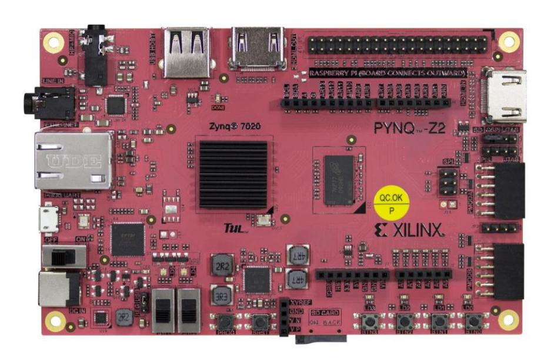

The PYNQ-Z2 is a Zynq development board designed to be used with the PYNQ™, an open-source framework.

To find out more about PYNQ, please see the project webpage at [www.pynq.io.](http://www.pynq.io/) Here you will find materials to help you get started with PYNQ and a forum for contacting the supporting community.

### Contents

| 1 PYNQ-Z2 features                     | 4  |
|----------------------------------------|----|
| 2 Board files and XDC constraints file | 6  |
| 3 Power                                | 7  |
| 4 Boot mode selection                  | 8  |
| 5 Clock Sources                        | 9  |
| 6 DRAM                                 | 10 |
| 7 Quad SPI Flash                       | 11 |
| 8 USB Host                             | 12 |
| 9 ADAU1761 Audio Codec                 | 13 |
| 10 MicroSD.                            | 14 |
| 11 Ethernet PHY                        | 15 |
| 12 MicroUSB Port                       | 17 |
| 13 HDMI ports                          | 18 |
| 14 LEDs, Buttons, Switches             | 20 |
| 15 Board reset signals                 | 22 |
| 16 Pmod Ports                          | 23 |
| 17 Arduino Shield Connector            | 25 |
| 18 Raspberry Pi Header                 | 30 |
| 19 References                          | 31 |

# 1 PYNQ-Z2 features

#### • **ZYNQ XC7Z020-1CLG400C**

- o 650MHz ARM® Cortex®-A9 dual-core processor
- o Programmable logic
  - 13,300 logic slices, each with four 6-input LUTs and 8 flipflops
  - 630 KB block RAM
  - 220 DSP slices
  - On-chip Xilinx analog-to-digital converter (XADC)
- o Programmable from JTAG, Quad-SPI flash, and MicroSD card

#### • **Memory and storage**

- o 512MB DDR3 with 16-bit bus @ 1050Mbps
- o 16MB Quad-SPI Flash with factory programmed 48-bit globally unique EUI-48/64™ compatible identifier
- o MicroSD slot

#### • **Power**

o USB or 7V-15V external power regulator

#### • **USB and Ethernet**

- o Gigabit Ethernet PHY
- o Micro USB-JTAG Programming circuitry
- o Micro USB-UART bridge
- o USB 2.0 OTG PHY (supports host only)

#### • **Audio and Video**

- o 2x HDMI ports (input and output)
- o 24bit I2S DAC with 3.5mm TRRS jack
- o Line-in with 3.5mm jack

### • **Switches, Push-buttons and LEDs**

- o 4 push-buttons
- o 2 slide switches
- o 4 LEDs
- o 2 RGB LEDs

#### • **Expansion Connectors**

- o 2xPmod ports
  - 16 Total FPGA I/O (8 pins on Pmod A are shared with Raspberry Pi connector)
- o Arduino Shield compatible connector

- 24 Total FPGA I/O
- 6 Single-ended 0-3.3V Analog inputs to XADC
- o Raspberry Pi connector
  - 28 Total FPGA I/O (8 pins are shared with Pmod A)

Refer to the schematics for details on shared pins: [http://www.tul.com.tw/download/TUL\\_PYNQ%20Schematic\\_R12.pdf](http://www.tul.com.tw/download/TUL_PYNQ%20Schematic_R12.pdf)

# 2 Board files and XDC constraints file

Board files containing the Zynq PS configuration for the PYNQ-Z2 can be downloaded from the TUL website:

<http://www.tul.com.tw/download/pynq-z2.zip>

The board files can be used with Vivado to automatically configure the PS when creating new Zynq designs for the board.

A master XDC constraints file which contains pin constraints for the PYNQ-Z2 is also available from the TUL website:

[http://www.tul.com.tw/download/pynq-z2\\_v1.0.xdc.zip](http://www.tul.com.tw/download/pynq-z2_v1.0.xdc.zip)

# 3 Power

The PYNQ-Z2 can be powered from the Micro-USB port (J8), an external power supply, or a battery. The power source is selected by setting jumper J9 (near SW1) to USB or REG (External power REGulator/Battery).

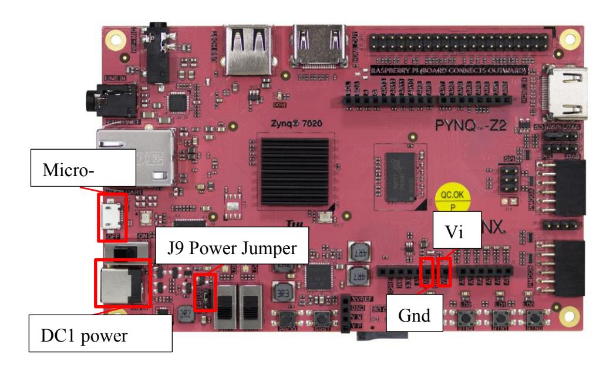

The MicroUSB port connects to a standard USB port and should provide enough power for most designs. More demanding applications may require more power than the USB port can provide.

When more power is required, an external power regulator (coax, center-positive 2.1mm internal-diameter plug) can be connected to the power jack (DC1). The board supports 7VDC to 15VDC (12V recommended). Suitable supplies can be purchased from the TUL website.

A battery can also be used to power the PYNQ-Z2 by attaching the positive terminal to the "VIN" pin on the Arduino J7 connector (with jumper J9 set to REG). The negative terminal can be connected to one of the pins labeled GND on J7.

# 4 Boot mode selection

The PYNQ-Z2 supports MicroSD, Quad SPI Flash, and JTAG boot modes. The boot mode is selected using the Mode jumper (JP1). TO select the boot mode, move the jumper to the appropriate position as indicated by the label on the board.

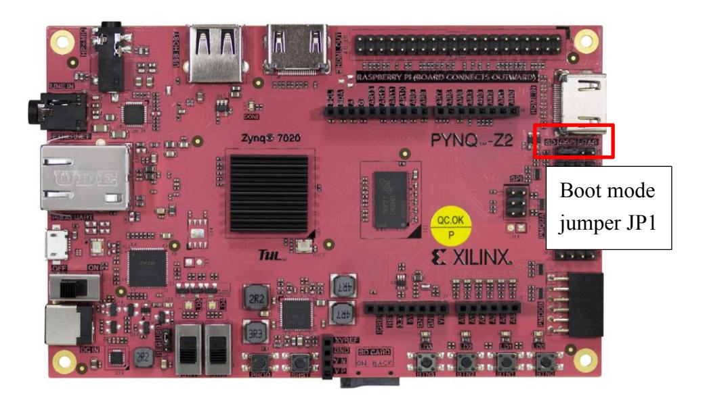

# 5 Clock Sources

The PYNQ-Z2 provides a 50 MHz clock to the Zynq PS\_CLK input, which is used to generate the clocks for each of the PS subsystems. The 50 MHz input allows the processor to operate at a maximum frequency of 650 MHz.

The PYNQ-Z2 also has an external 125 MHz reference clock connected to pin H16 of the PL. The external reference clock allows the PL to be used independently of the PS.

Figure 6.1 outlines the clocking scheme used on the PYNQ-Z2. Note that the reference clock output from the Ethernet PHY is used as the 125 MHz reference clock to the PL. When the PHYRSTB signal is driven low, the Ethernet PHY (U5) is held in reset disabling the CLK125.

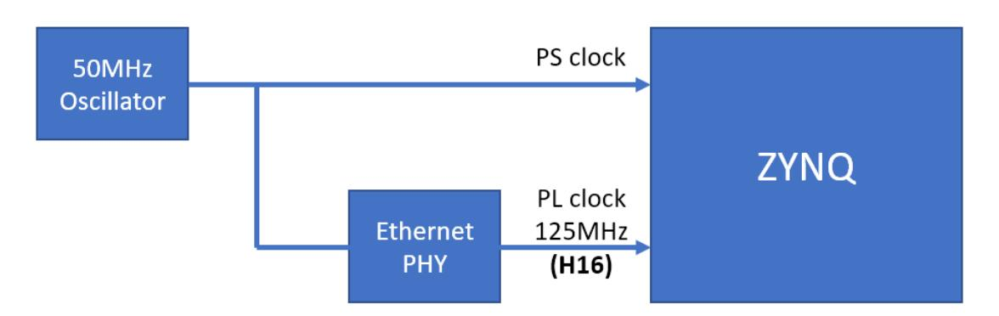

For a full description of the capabilities of the Zynq PL clocking resources, refer to the "7 Series FPGAs Clocking Resources User Guide" available from Xilinx.

# 6 DRAM

The PYNQ-Z2 includes a Micron 256Mx16 DDR3 memory (MT41K512M16HA-125:A) creating a single rank, 16-bit wide interface with a total capacity of 512MB. The DDR3 is connected to the hard memory controller in the Processor Subsystem (PS).

The PS incorporates an AXI memory port interface, a DDR controller, the associated PHY, and a dedicated I/O bank. DDR3 memory interface supports speeds of up to 525 MHz/1050 Mbps on the PYNQ-Z2 board.

For best DDR3 performance, DRAM training is enabled for write leveling, read gate, and read data eye options in the PS Configuration Tool in the Xilinx tools. Training is done dynamically by the controller to account for board delays, process variations and thermal drift.

The PYNQ-Z2 board files (see section 2) contain the configuration for the DRAM controller which includes optimum starting values for the training process taking into account PCB and trace delays (propagation delays) for the memory signals board delays are specified for each of the byte groups. These parameters are board-specific and were calculated from the PCB trace length reports. The DQS to CLK Delay and Board Delay values are calculated specific to the PYNQ-Z2 memory interface PCB design.

# 7 Quad SPI Flash

The PYNQ-Z2 features a Spansion S25FL128S Quad SPI serial NOR flash.

- 16 MB
- x1, x2, and x4 support
- Bus speeds up to 104 MHz, supporting Zynq configuration rates @ 100 MHz In Quad SPI mode, this translates to 400Mbs
- Powered from 3.3V

The Multi-I/O SPI Flash memory can be used to initialize and boot the PS subsystem as well as configure the PL subsystem, or as non-volatile code and data storage.

The SPI Flash connects to the Zynq-7000 SoC and supports the Quad SPI interface. This requires connection to MIO[1:6,8] as outlined in the Zynq datasheet.

| MIO Pin | Name    |
|---------|---------|
| 1       | CS      |
| 2       | DQ0     |
| 3       | DQ1     |
| 4       | DQ2     |
| 5       | DQ3     |
| 6       | SCLK    |
| 7       | VCFG0   |
| 8       | SLCK FB |

*Table 1 SPI Flash MIO pin mapping*

Quad-SPI feedback mode is used, thus qspi\_sclk\_fb\_out/MIO[8] is left to freely toggle and is connected only to a 20K pull-up resistor to 3.3V. This allows a Quad SPI clock frequency greater than FQSPICLK2

# 8 USB Host

The PYNQ-Z2 includes a TI TUSB1210 USB 2.0 PHY with an 8-bit ULPI interface connected to the Zynq PS USB 0 controller (MIO[28-39]). The PHY features a HS-USB Physical Front-End supporting speeds of up to 480Mbs. The USB interface is configured to act as an embedded host. USB OTG and USB device modes are not supported.

One of the Zynq PS USB controllers can be connected to the appropriate MIO pins to control the USB port.

| MIO Pin | Name                 | MIO Pin      | Name |
|---------|----------------------|--------------|------|
| 11      | USB Over             |              |      |
|         | Current              | 34 DATA2  |      |
| 28      | DATA4 35 DATA3 |              |      |
| 29      | DIR 36 CLK     |              |      |
| 30      | STP 37 DATA5   |              |      |
| 31      | NXT 38 DATA6   |              |      |
| 32      | DATA0 39 DATA7 |              |      |
| 33      | DATA1                | 46 RESETN |      |

*Table 2 USB MIO pin mapping*

# 9 ADAU1761 Audio Codec

The PYNQ-Z2 has an Analog Devices ADAU1761 audio codec. It allows for stereo 48KHz record and playback. Sample rates from 8KHz to 96KHz are supported. Additionally, the ADAU1761 provides digital volume control. The Codec can be configured using Analog Devices SigmaStudio™ for optimizing audio for specific acoustics, numerous filters, algorithms and enhancements. Analog Devices provides Linux drivers for this device.

[http://www.analog.com/en/content/cu\\_over\\_sigmastudio\\_graphical\\_dev\\_tool\\_overvie](http://www.analog.com/en/content/cu_over_sigmastudio_graphical_dev_tool_overview/fca.html) [w/fca.html](http://www.analog.com/en/content/cu_over_sigmastudio_graphical_dev_tool_overview/fca.html)

# 10 MicroSD

The PYNQ-Z2 has a MicroSD slot (SD1). An SD card can be used to boot the board, or for applications that require non-volatile external memory storage. The PS IOP controller SDIO 0 is wired to this port via MIO[40-47]. The pinout can be seen in Table 7.1. The peripheral controller supports SDIO host mode with 1-bit and 4-bit SD transfer modes. SPI mode is not supported.

The Zynq PS UART control can be connected to the appropriate MIO pins to control the MicroSD port.

| MIO Pin | Name |
|---------|------|
| 40      | CCLK |
| 41      | CMD  |
| 42      | D0   |
| 43      | D1   |
| 44      | D2   |
| 45      | D3   |
| 47      | CD   |

*Table 3 SD MIO pin mapping*

The maximum clock frequency is 50 MHz which supports both low-speed and highspeed cards. A Class 4 MicroSD card or better is recommended.

# 11 Ethernet PHY

The PYNQ-Z2 has a Realtek RTL8211E-VL PHY supporting 10/100/1000 Ethernet. The PHY is connected to the Zynq RGMII controller. The auxiliary interrupt (INTB) and reset (PHYRSTB) signals connect to MIO pins MIO10 and MIO9, respectively.

One of the Zynq PS Ethernet controllers can be connected to the appropriate MIO pins to control the Ethernet port.

| MIO Pin | Name                 | MIO Pin     | Name |
|---------|----------------------|-------------|------|
| 9       | Ethernet Reset       | 25          | RXD2 |
| 10      | Ethernet             |             | RXD3 |
|         | Interrupt            | 26          |      |
| 16      | TXCK                 | 27 RXCTL |      |
| 17      | TXD0                 | 23          | RXD0 |
| 18      | TXD1 24 RXD1   |             |      |
| 19      | TXD2 25 RXD2   |             |      |
| 20      | TXD3                 | 26          | RXD3 |
| 21      | TXCTL 27 RXCTL |             |      |
| 22      | RXCK                 | 52 MDC   |      |
| 23      | RXD0                 | 53 MDIO  |      |
| 24      | RXD1                 |             |      |

*Table 4 Ethernet MIO pin mapping*

The Zynq does not need to be configured for the PHY to establish a connection. After power-up the PHY starts with Auto Negotiation enabled, advertising 10/100/1000 link speeds and full duplex. The PHY will automatically establishes a link if there is an Ethernet-capable partner connected.

There are two status LEDs on the RJ-45 connector that indicate traffic activity and link status. Table 9.1 shows the default behavior.

| LED            | Color  | Description                                    |
|----------------|--------|------------------------------------------------|
| Link LED       | Green  |  Blinking: Transmitting or Receiving       |
| (Right)        |        |                                                |
| Act LED (Left) | Yellow |  Blinking: There is activity on this port. |
|                |        |  Off: No link is established.              |

*Table 5 Ethernet status LEDs*

Although the default power-up configuration of the PHY might be enough in most applications, the MDIO bus is available to manage the interface. The RTL8211E-VL is assigned the 5-bit address 00001 on the MDIO bus. With simple register read and write commands, status information can be read out and the configuration can be changed. The Realtek PHY follows an industry-standard register map for basic configuration.

The PHY is clocked from the same 50 MHz oscillator that clocks the Zynq PS.

#### **MAC address**

A one-time-programmable (OTP) region of the Quad-SPI flash has been factory programmed with a 48-bit globally unique EUI-48/64™ compatible identifier. The OTP address range [0x20;0x25] contains the identifier with the first byte in transmission byte order being at the lowest address. Refer to the [Flash memory](http://www.cypress.com/file/177966/download)  [datasheet](http://www.cypress.com/file/177966/download) for information on how to access the OTP regions. When using the PYNQ framework, Ethernet is automatically handled in the boot-loader, and the Linux system is automatically configured to use this unique MAC address.

# 12 MicroUSB Port

The PYNQ-Z2 includes an FTDI FT2232HL USB-UART bridge (attached to connector J8 PROG UART) that supports USB-JTAG, USB-UART. The PYNQ-Z2 can also be powered from the MicroUSB port. The USB\_UART allows PC applications to communicate with the board using standard COM port commands (or the tty interface in Linux and MacOS). The Zynq PS UART 0 controller is used to connect to the UART device.

One of the Zynq PS UART controllers can be connected to the appropriate MIO pins to control the UART port.

| MIO Pin | Name       |
|---------|------------|
| 14      | UART Input |
| 15      | UART       |
|         | Output     |

*Table 6 UART MIO pin mapping*

#### **Driver**

The driver for the USB\_UART should be automatically installed when the board is connected to a computer using Windows 7 or later operating system, and recent versions of Linux and MacOS.

# 13 HDMI ports

The PYNQ-Z2 contains two unbuffered HDMI ports connected directly to the PL. The board labels indicate one HDMI port as input and the other port as output, but as both ports are connected to PL pins, the designer can choose to use each of these ports as input or output. Both ports use HDMI type-A receptacles with the data and clock signals terminated and connected directly to the Zynq PL.

The 19-pin HDMI connectors include three differential data channels, one differential clock channel five GND connections, a one-wire Consumer Electronics Control (CEC) bus, a two-wire Display Data Channel (DDC) bus, a Hot Plug Detect (HPD) signal, a 5V signal capable of delivering up to 50mA, and one reserved (RES) pin. All non-power signals are connected to the Zynq PL with the exception of RES.

| Pin/Signal     | J11 (source) J18                                    |          | J10 (sink)                                          |          |
|----------------|-----------------------------------------------------|----------|-----------------------------------------------------|----------|
|                | Description                                         | FPGA pin | Description                                         | FPGA pin |
| D[2]_P, D[2]_N | Data output                                         | J18, H18 | Data input                                          | N20, P20 |
| D[1]_P, D[1]_N | Data output                                         | K19, J19 | Data input                                          | T20, U20 |
| D[0]_P, D[0]_N | Data output                                         | K17, K18 | Data input                                          | V20, W20 |
| CLK_P, CLK_N   | Clock output                                        | L16, L17 | Clock input                                         | N18, P19 |
| CEC            | Consumer Electronics Control bidirectional | G15      | Consumer Electronics Control bidirectional | H17      |
| SCL, SDA       | DDC bidirectional                                   | B9,B13   | DDC bidirectional                                | U14, U15 |
| HPD/HPA        | Hot-plug detect input (inverted)                 | R19      | Hot-plug assert output                           | T19      |

*Table 7 HDMI pin descriptions and PL pin locations*

The Zynq PS I2C controller can be connected to the appropriate MIO pins to control the I2C interface to the HDMI controller.

| MIO Pin | Name            |
|---------|-----------------|
| 50      | HDMI_TX_S CL |
| 51      | HDMI_TX_S DA |

*Table 8 HDMI I2C MIO pin mapping*

# 14 LEDs, Buttons, Switches

The PYNQ-Z2 board includes 2 tri-color LEDs, 2 dipswitches, 4 push buttons, and 4 individual LEDs connected to the PL.

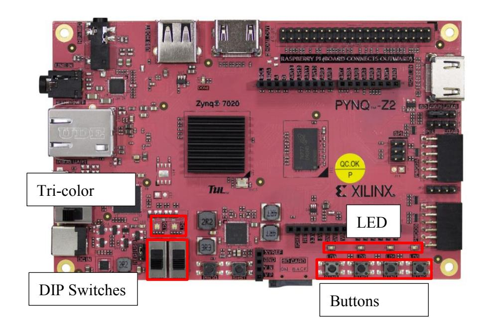

#### **Push-buttons**

The four push buttons generate a logic high on the corresponding PL pin when pressed.

| Signal Name | PL PIN |
|-------------|--------|
| BTN0        | D19    |
| BTN1        | D20    |
| BTN2        | L20    |
| BTN3        | L19    |

*Table 9 Push Button PL pin mapping*

### **Switches**

When the switches are closed (in the "up" position) they generate a logic high on the corresponding PL pins.

| Signal Name | PL PIN |
|-------------|--------|
| SW0         | M20    |
| SW1         | M19    |

*Table 10 Dip switch PL pin mapping*

#### **LEDs**

The four individual LEDs are anode-connected to the Zynq PL via 330-ohm resistors. Applying logic high to the appropriate pins will turn on the LEDs.

| Signal Name | PL PIN |
|-------------|--------|
| LED0        | R14    |
| LED1        | P14    |
| LED2        | N16    |
| LED3        | M14    |

*Table 11 LED PL pin mapping*

The board also includes LEDs indicating board power, PL programming "done", and status for USB and Ethernet.

#### **Tri color LEDs**

Each of the 2 tri-color LEDs consists of three internal Reg, Blue Green LEDs. The input signals to the internal RGB LEDs are driven by the Zynq PL through a transistor, which inverts the signals.

| Signal Name | PL PIN |
|-------------|--------|
| LD4 Blue    | L15    |
| LD4 Red     | N15    |
| LD4 Green   | G17    |
| LD5 Blue    | G14    |
| LD5 Red     | M15    |
| LD5 Green   | L14    |

*Table 12 LED PL pin mapping*

The tri-color LEDs are high intensity. It is recommended to use pulse-width modulation (PWM) when driving the tri-color LEDs nd to aid driving the tri-color LEDs with more than a 50% duty cycle. Using PWM also allows the LED to support a wide range of colors by adjusting the duty cycle of each color.

# 15 Board reset signals

SRST is the external system reset. It resets the Zynq device without disturbing the debug environment. System reset erases all memory content within the PS, including the OCM. The PL is also cleared during a system reset. System reset does not cause the boot mode strapping pins to be re-sampled.

The SRST button also causes the CK\_RST signal to toggle in order to trigger a reset on any attached shields.

The Zynq PS supports external power-on reset, a master reset of the whole chip. The TPS65400 power regulator drives a PGOOD signal to hold the system in reset until all power supplies are valid.

The PROG push switch, labeled PROG, enables Zynq PROG\_B. This resets the PL and causes DONE to be de-asserted. The PL will remain unconfigured until it is reprogrammed by the processor or via JTAG.

# 16 Pmod Ports

There are 2 Pmod ports on the PYNQ-Z2, labelled A and B.

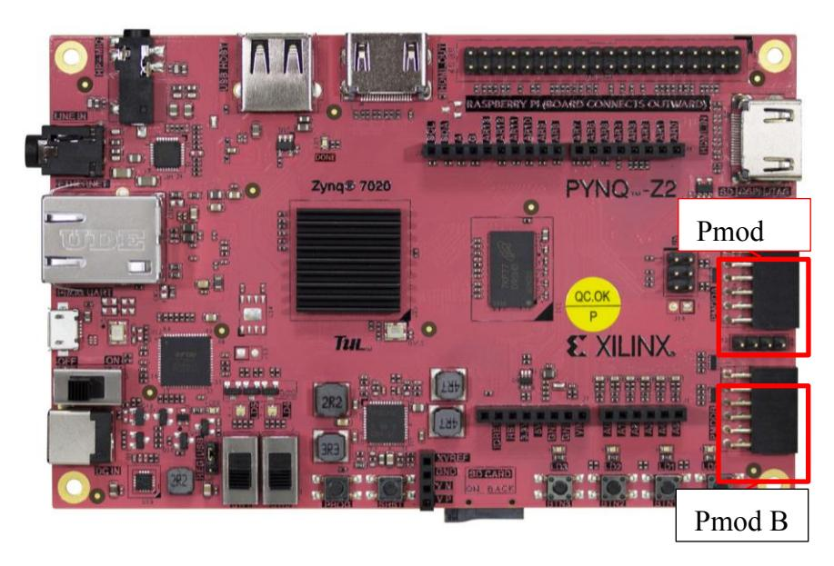

Pmod ports are 2×6, right-angle, 100-mil spaced female connectors that mate with standard 2×6 pin headers. Each 12-pin Pmod port provides two 3.3V VCC signals (pins 6 and 12), two Ground signals (pins 5 and 11), and eight logic signals, as shown in Figure 16.1.

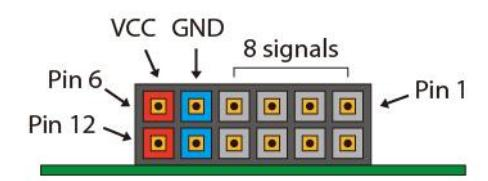

The VCC and Ground pins can deliver up to 1A of current.

#### PMODA

| Signal Name | Description | Pin Number | ZYNQ PIN |
|-------------|-------------|------------|----------|
| JA1_P       | I/O         | 1          | Y18      |
| JA1_N       | I/O         | 2          | Y19      |
| JA2_P       | I/O         | 3          | Y16      |
| JA2_N       | I/O         | 4          | Y17      |
| GND         | GND         | 5          | N/C      |
| 3V3         | POWER       | 6          | N/C      |
| JA3_P       | I/O         | 7          | U18      |
| JA3_N       | I/O         | 8          | U19      |
| JA4_P       | I/O         | 9          | W18      |
| JA4_N       | I/O         | 10         | W19      |
| GND         | GND         | 11         | N/C      |
| 3V3         | POWER       | 12         | N/C      |

*Table 13 Pmod A pin description and PL pin assignments*

#### PMODB

| Signal Name | Description | Pin Number | ZYNQ PIN |
|-------------|-------------|------------|----------|
| JB1_P       | I/O         | 1          | W14      |
| JB1_N       | I/O         | 2          | Y14      |
| JB2_P       | I/O         | 3          | T11      |
| JB2_N       | I/O         | 4          | T10      |
| GND         | GND         | 5          | N/C      |
| 3V3         | POWER       | 6          | N/C      |
| JB3_P       | I/O         | 7          | V16      |
| JB3_N       | I/O         | 8          | W156     |
| JB4_P       | I/O         | 9          | V12      |
| JB4_N       | I/O         | 10         | W13      |
| GND         | GND         | 11         | N/C      |
| 3V3         | POWER       | 12         | N/C      |

*Table 14 Pmod B pin description and PL pin assignments*

\* Pmod A pins are shared with the Raspberry Pi header

# 17 Arduino Shield Connector

The Arduino shield connector has 26 pins connected to the Zynq PL. The pins can be used as GPIO. Compatible Arduino shields can be connected to the PYNQ-Z2 board via this header to extended functionality. Note that as the Arduino header is connected to the PL, a design with appropriate controllers must be loaded before the Arduino header can be used. Six of the Arduino pins (labeled A0-A5) can also be used as single-ended analog inputs with an input range of 0V-3.3V, and another six (labeled AR0-AR13) can be used as differential analog inputs.

**Note: The PYNQ-Z2 is not compatible with shields that output 5V digital or analog signals. Driving pins on the PYNQ-Z2 shield connector above 5V may cause damage to the Zynq.**

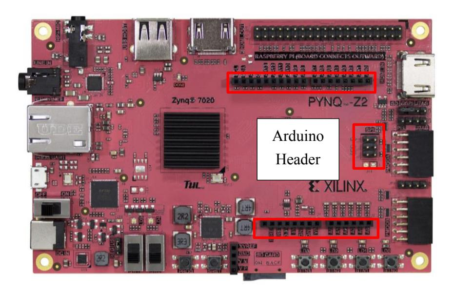

**Shield** 

### **Digital I/O**

The pins connected directly to the Zynq PL can be used as general-purpose inputs/outputs. These pins include the pins labelled I2C (SCL, SDA), SPI (SS, SCL, MISO, MOSI), and general purpose I/O pins. There are 200 Ohm series resistors between the FPGA and the digital I/O pins to help provide protection against accidental short circuits. The absolute maximum and recommended operating voltages for these pins are outlined in the table below.

|           | Absolute | Recommended       | Recommended       | Absolute        |
|-----------|----------|-------------------|-------------------|-----------------|
|           | Minimum  | Minimum Operating | Maximum Operating | Maximum Voltage |
|           | Voltage  | Voltage           | Voltage           |                 |
| Powered   | -0.4V    | -0.2V             | 3.4V              | 3.75V           |
| Unpowered | -0.4V    | N/A               | N/A               | 0.55V           |

*Table 15 Arduino header digital pin voltages*

For more information on the electrical characteristics of the pins connected to the Zynq PL, please see the [Zynq-7000 datasheet](http://www.xilinx.com/support/documentation/data_sheets/ds187-XC7Z010-XC7Z020-Data-Sheet.pdf) from Xilinx.

#### **Arduino J3 pins**

| Signal Name | Description | Pin Number | ZYNQ PIN |
|-------------|-------------|------------|----------|
| AR8         | I/O         | 1          | V17      |
| AR9         | I/O         | 2          | V18      |
| AR10        | I/O         | 3          | T16      |
| AR11        | I/O         | 4          | R17      |
| AR12        | I/O         | 5          | P18      |
| AR13        | I/O         | 6          | N17      |
| GND         | GND         | 7          | N/C      |
| A           | I/O         | 8          | Y13      |
| AR_SDA      | SDA         | 9          | P16      |
| AR_SCL      | SCL         | 10         | P15      |

*Table 16 Arduino J3 header PL pin assignments*

#### **Arduino J4 pins**

| Signal Name | Description | Pin Number | ZYNQ PIN |
|-------------|-------------|------------|----------|
| AR0         | I/O         | 1          | T14      |
| AR1         | I/O         | 2          | U12      |
| AR2         | I/O         | 3          | U13      |
| AR3         | I/O         | 4          | V13      |
| AR4         | I/O         | 5          | V15      |
| AR5         | I/O         | 6          | T15      |
| AR6         | I/O         | 7          | R16      |
| AR7         | I/O         | 8          | U17      |

*Table 17 Arduino J4 header PL pin assignments*

#### **Arduino J7 pins**

| Signal Name | Description | Pin Number | ZYNQ PIN     |  |  |
|-------------|-------------|------------|--------------|--|--|
| VU_CK       | POWER       | 1          | N/C          |  |  |
| GND         | GND         | 2          | N/C          |  |  |
| GND         | GND         | 3          | N/C          |  |  |
| 5V5         | POWER       | 4          | N/C          |  |  |
| 3V3         | POWER       | 5          | N/C          |  |  |
| AR_RST      | RST         | 6          | PS_MIO12_500 |  |  |
| 3V3         | POWER       | 7          | N/C          |  |  |
| N/C         | N/C         | 8          | N/C          |  |  |

*Table 18 Arduino J7 header pin descriptions and connections*

#### **Arduino SPI pins**

| Signal Name | Description | Pin Number | ZYNQ PIN |
|-------------|-------------|------------|----------|
| AR_MISO     | MISO        | 1          | W15      |
| 3V3         | POWER       | 2          | N/C      |
| AR_SCK      | SCK         | 3          | H15      |
| AR_MOSI     | MOSI        | 4          | T12      |
| AR_SS       | SS          | 5          | F16      |
| GND         | GND         | 6          | N/C      |

*Table 19 Arduino SPI header pin descriptions and PL pin assignments*

#### **Shield Analog I/O (Arduino J1)**

The pins labeled A0-A5 and V\_P/V\_N are used as analog inputs to the XADC module of the Zynq. The Zynq expects that the inputs range from 0-1 V. On the pins labeled A0-A5 we use an external circuit to scale down the input voltage from 3.3V.

| Signal Name | Description | Pin Number | ZYNQ PIN |
|-------------|-------------|------------|----------|
| A5          | I/O         | 1          | U10      |
| A4          | I/O         | 2          | T5       |
| A3          | I/O         | 3          | V11      |
| A2          | I/O         | 4          | W11      |
| A1          | I/O         | 5          | Y12      |
| A0          | I/O         | 6          | Y11      |

*Table 20 Arduino J1 header analog pin descriptions and PL pin assignments*

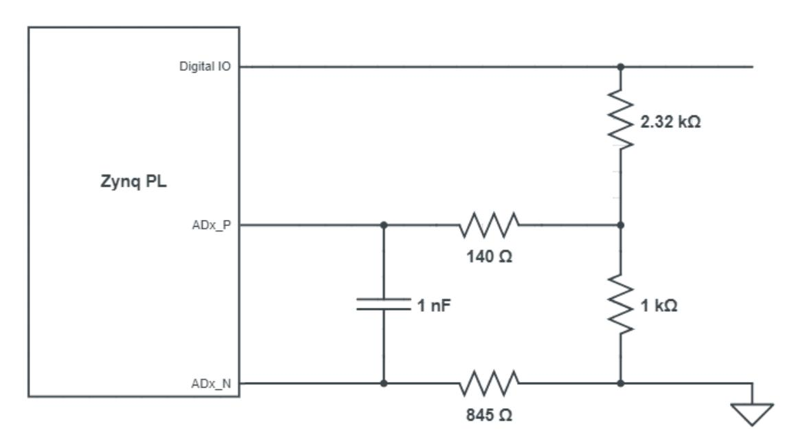

*Figure 1 Single-Ended Analog Inputs*

This circuit allows the XADC module to accurately measure any voltage between 0V and 3.3V (relative to the PYNQ-Z2's GND) that is applied to any of these pins.

If you wish to use the pins labeled A0-A5 as Digital inputs or outputs, they are also connected directly to the Zynq PL before the resistor divider circuit.

The pins labeled V\_P and V\_N are connected to the VP\_0 and VN\_0 dedicated analog inputs of the FPGA. This pair of pins can also be used as a differential analog input with voltage between 0-1V, but they cannot be used as Digital I/O.

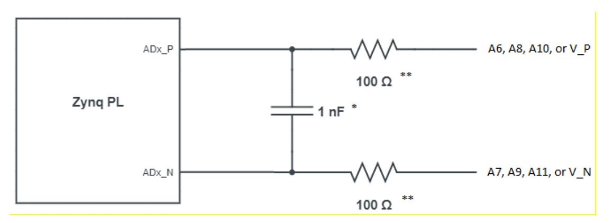

*Figure 2 Differential Analog Inputs*

For more information on the XADC, see the Xilinx document titled "7 Series FPGAs

*\* Note that the 1nF capacitor is only loaded for V\_P/VN*

*\*\* For V\_P/V\_N, 140 Ohm resisters are used.* 

#### and Zynq-7000 SoC XADC Dual 12-Bit 1 MSPS Analog-to-Digital Converter".

#### **XADC header J5**

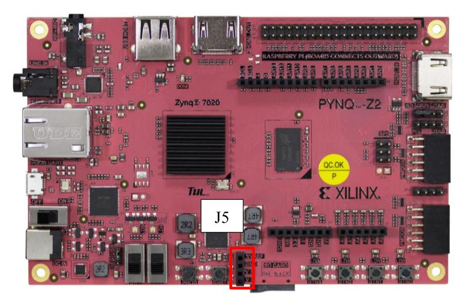

| Signal Name | Description | Pin Number | ZYNQ PIN |
|-------------|-------------|------------|----------|
| XADC_V_P    | POWER       | 1          | VP_0     |
| XADC_V_N    | GND         | 2          | VN_0     |
| XADCGND     | GND         | 3          | N/C      |
| XADCVREF    | POWER       | 4          | N/C      |

*Table 21 J5 header XADC pin descriptions and PL pin assignments*

# 18 Raspberry Pi Header

The PYNQ-Z2 has a 40-pin Raspberry Pi connector with 28 pins connected to the Zynq device.

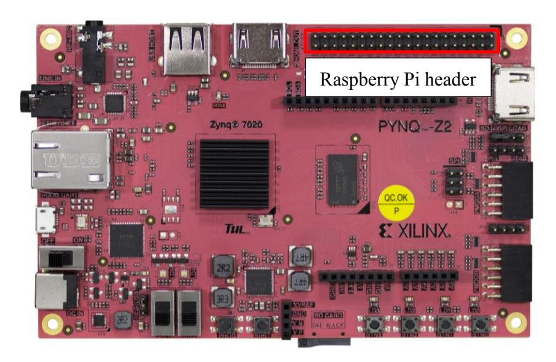

These pins can be used as GPIO, or to connect a standard Raspberry Pi peripheral.

| G  | W9  | Y8  | W8 | Y7  | Y6 | Y16 | G   | W10 V10 |     | V8 | V   | U8 | V7 | U7  | G   | V6  | W19 W18 |   | G |
|----|-----|-----|----|-----|----|-----|-----|---------|-----|----|-----|----|----|-----|-----|-----|---------|---|---|
| 39 | 37  | 35  | 33 | 31  | 29 | 27  | 25  | 23      | 21  | 19 | 17  | 15 | 13 | 11  | 9   | 7   | 5       | 3 | 1 |
| 40 | 38  | 36  | 34 | 32  | 30 | 28  | 26  | 24      | 22  | 20 | 18  | 16 | 14 | 12  | 10  | 8   | 6       | 4 | 2 |
| Y9 | A20 | B19 | G  | B20 | G  | Y17 | F20 | F19     | U19 | G  | U18 | W6 | G  | C20 | Y19 | Y18 | G       | V | V |

G Ground

V 3.3V

V 5V

… Raspberry Pi header pin number

… Zynq Pin

*Table 22 Raspberry Pi header pin layout and Zynq PL pin assignments*

# 19 References

PYNQ-Z2 schematics:

[http://www.tul.com.tw/download/TUL\\_PYNQ%20Schematic\\_R12.pdf](http://www.tul.com.tw/download/TUL_PYNQ%20Schematic_R12.pdf)

UG585 Zynq TRM

[https://www.xilinx.com/support/documentation/user\\_guides/ug585-Zynq-7000-](https://www.xilinx.com/support/documentation/user_guides/ug585-Zynq-7000-TRM.pdf) [TRM.pdf](https://www.xilinx.com/support/documentation/user_guides/ug585-Zynq-7000-TRM.pdf)

UG472 7 Series FPGAs Clocking Resources User Guide [https://www.xilinx.com/support/documentation/user\\_guides/ug472\\_7Series\\_Clocking](https://www.xilinx.com/support/documentation/user_guides/ug472_7Series_Clocking.pdf) [.pdf](https://www.xilinx.com/support/documentation/user_guides/ug472_7Series_Clocking.pdf)

### **Mouser Electronics**

Authorized Distributor

Click to View Pricing, Inventory, Delivery & Lifecycle Information:

[Seeed Studio](https://www.mouser.com/seeed-studio): [102110204](https://www.mouser.com/access/?pn=102110204)